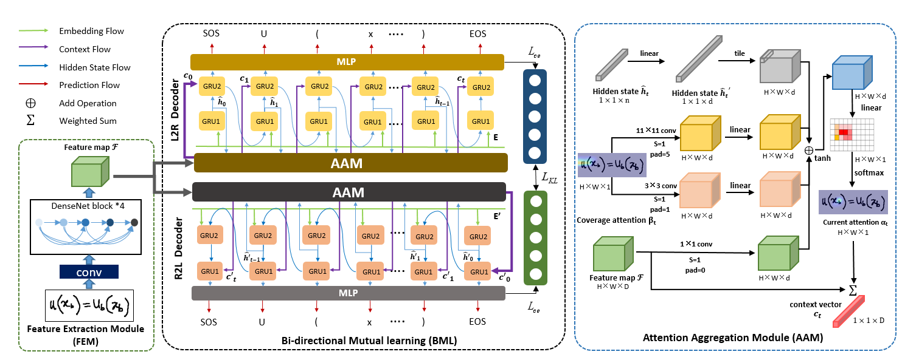

# ABM 

将ABM应用于中小学混合公式识别中

## Methods

*  DenseNet 作为特征提取器；
* Attention Aggregation模块。提出多尺度覆盖attention来识别数学表达式中不同大小的字符，从而提高了当前时刻的识别准确率，缓解了错误累积的问题；
* Bi-directional Mutual Learning模块，提出了一种新颖的解码器框架，具有两个解码方向相反的并行解码器分支（L2R 和 R2L），并使用相互蒸馏来相互学习。具体来说，该框架有助于当前的覆盖注意力同时充分利用历史和未来的信息，从而更好地确定当前的注意力位置。因此，每个分支可以通过逐步相互学习来学习更多互补的上下文信息并探索远距离依赖信息，从而获得更强的解码能力。请注意，虽然我们使用两个解码器进行训练，但我们只使用一个 L2R 分支进行推理。

</p>

<p align="center">

<br><br>
<b>Figure 1.</b> ABM L2R 分支的注意力（左：覆盖注意力，右：当前注意力）
</p>

</p>

<p align="center">

<br><br>
<b>Figure 2.</b> ABM R2L 分支的注意力（左：覆盖注意力，右：当前注意力）
</p>


<p align="center">

<br><br>
<b>Figure 3.</b>  ABM 的架构
</p>


## Requirements

- Python 3.6
- numpy == 1.19.4
- torch == 1.6.0

## Usage

```bash
# for training on CROHME 2014  with one L2R branch (baseline model)
sh train.sh -L2R

# for training on CROHME 2014  with two branches (L2R and R2L) (our model, ABM)
sh train.sh -L2R-R2L


# for testing on CROHME 2014, 2016, 2019 with L2R branch
sh test.sh -2014  L2R


# for testing on CROHME 2014, 2016, 2019 with R2L branch
sh test.sh -2014  R2L
```

**参考链接：**

[Handwritten Mathematical Expression Recognition via Attention Aggregation based Bi-directional Mutual Learning (AAAI 2022 Oral)]()